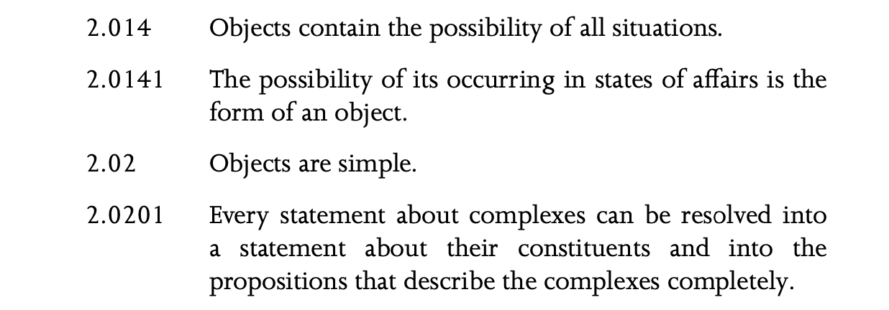
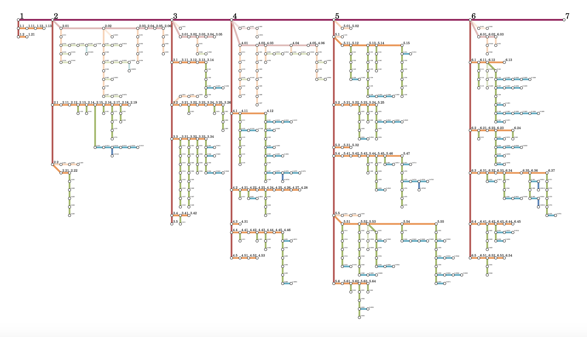
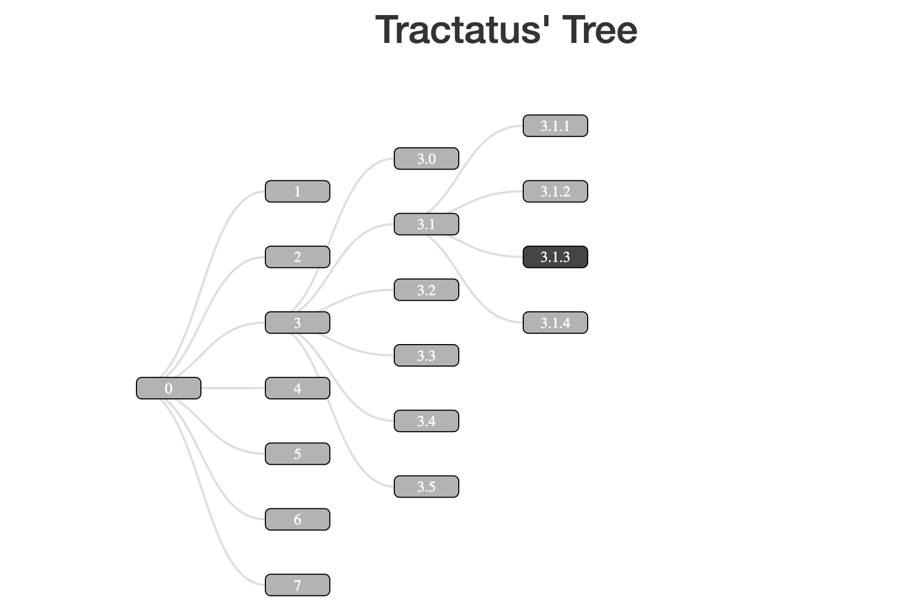
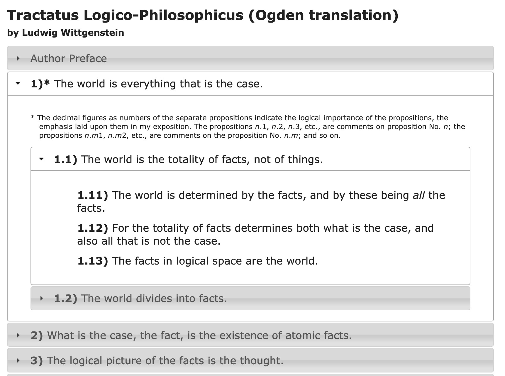
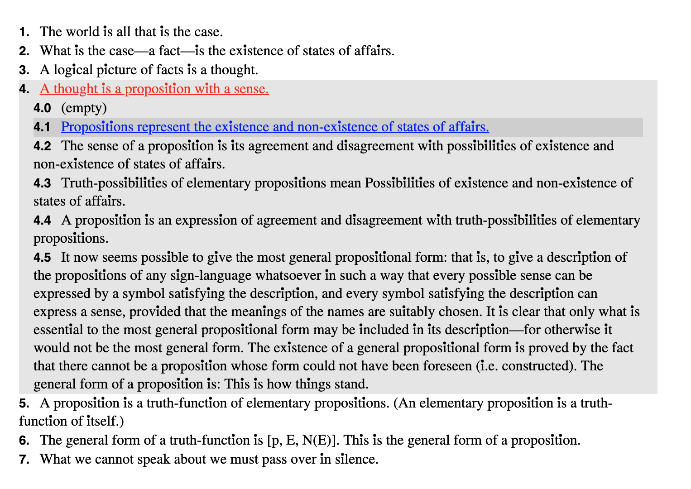
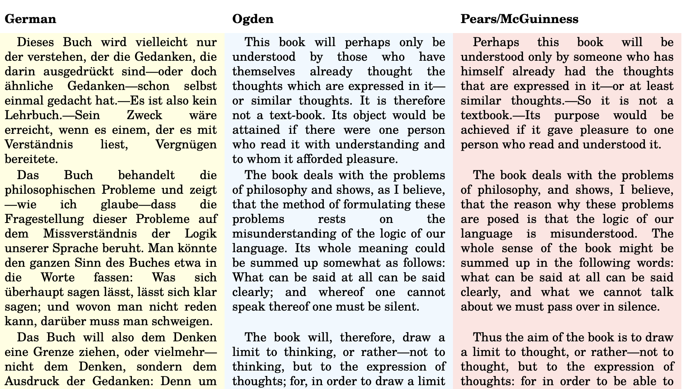
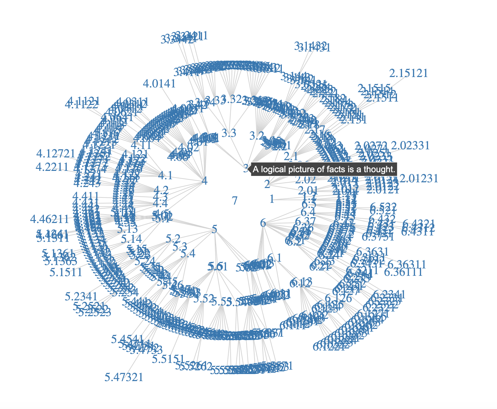

# Another Tractatus Tree

## The idea
Reading through the Tractatus Logico-Philosophicus by Ludwig Wittgenstein in print, I was puzzled by the lack of visual hierarchy for the branches of propositions.

This is how it looks:

The issue is the sub-propositions go up to 5 layers in from the first parent (e.g. 2.0.1.2.3.1). That's very difficult to elegantly format in a way that makes sense and is informative.

I have two objectives:

* **In print** I want to take on the task of typesetting the Tractatus such that the hierarchy is present and informative.

* **On the web** I want to experiment with both informative and experimental digital formats to map/present propositions.

## Wall Spaghetti:

Here my ideas so far — I'll build the first by Wednesday 11/18. See [predecessors](#user-content-ways-other-people-have-tried-this) for context.

* **A collapsible version** like [this](http://daxoliver.com/tractatus/) but with better typesetting and interactive features.
  * When only the main 1-7 propositions are open, the scale of the type goes up to fill the screen.
  * Could be understood as an accordion "nav menu" but not necessarily made to look that way graphically

* **A "draggable" canvas tree map** such as what both Juliette and Alex suggested for my idea last week.

* **A line hierarchy structure** similar to Tumblr/Reddit's form of organizing comment threads.
  * I imagine this may work well for print because it's highly compact.

* A version **visualization of the number of words/characters/sub-propositions** in props 1-7 through their scale/proportion.
  * I'm thinking of concentric circle groupings, like the ones people make in Prezi.

* **Interactive graphics** for specific propositions or sets of propositions, possibly utilizing the graphics in the book. Here's an example:
  * 5.5423 *To perceive a complex means to perceive that its constituents are related to one another in such and such a way. This no doubt also explains why there are two possible ways of seeing the figure:*
  * 
  * *as a cube; and all similar phenomena. For we really see two different facts. (If I look in the first place at the corners marked a and only glance at the b’s, then the a’s appear to be in front, and vice versa).*

## Typography

I want to keep my type choices consistent across all the viewing/reading formats I design. For that I'll need to settle on three styles:

* **The body text**; I want a serif that feels contemporary, highly legible, and not full of itself; I also want to reflect the logical dogma and philosophy of mathematics in this approach to language.
  * I am thinking of using [Signifier](https://klim.co.nz/blog/signifier-design-information/): "Signifier emerged from this alchemy with Bézier curves and sharp vectors determined by machine logic and a Brutalist ethos"

* **The "keys"** for each proposition; my natural inclination is to use a monospace for these

* **The mathematical figures** in some propositions, which would be interesting to typeset distinctly in some way from the body (similar to `code` in a markdown file). I think I need either a typeface with [math support](https://www.tug.org/FontCatalogue/mathfonts.html), or a monospace of some type.

## Ways other people have tried this

I'm not the first person to have this idea! I've tracked down a collection of researchers who have tried to come up with innovative digital formats to read or visualize the Tractatus. Here are a few examples:
c1|c2
---|---
|
|
|

The sources and my growing collection can be found in [this Are.na channel](https://www.are.na/nico-chilla/tractatus-visualizations)

## Development status:

This is forked from [Pierre Bellon's](https://pbellon.github.io/#!/en) D3 hierarchy visualization of the Tractatus; I gutted the repo and kept the JSON he scraped from [here](https://people.umass.edu/klement/tlp/tlp.html), which I'll use for each visualization I make.

You can see my first test, an indented DOM-dump, [here](https://nchilla.github.io/tractatus-tree/dom)

### In Progress:
* Change preface from Ogden version to Pears/McGuinness to match the rest
* Fix image filepaths
